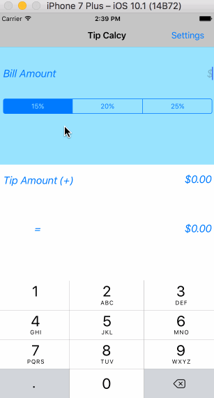

# TipCalcy
**TipCalcy:: Tip Calculator app for CodePath**

Time spent: 6 hours total

**Completed user stories:**

 1) Required: Basic tip calculator functionatliy
 
 2) Required: Settings page (for setting Defalut percent)
 
 3) Optional: Remember the bill amount across app restarts 
 
**Walkthrough of Required and Optional user stories:**

GIF created with [LiceCap](http://www.cockos.com/licecap/).
